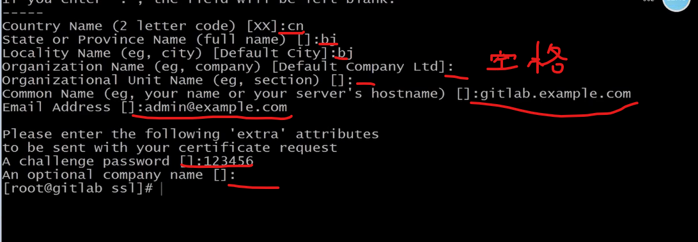
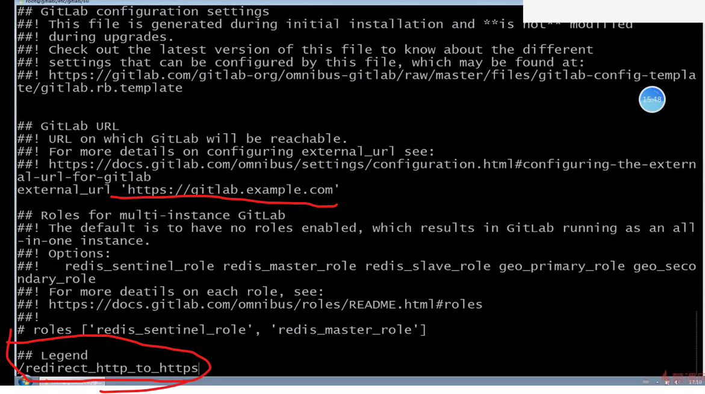
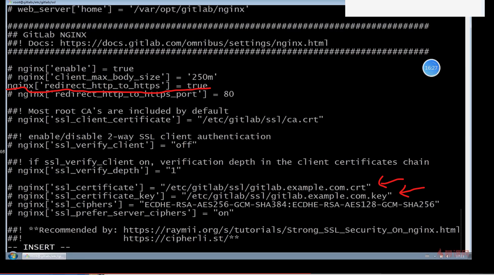
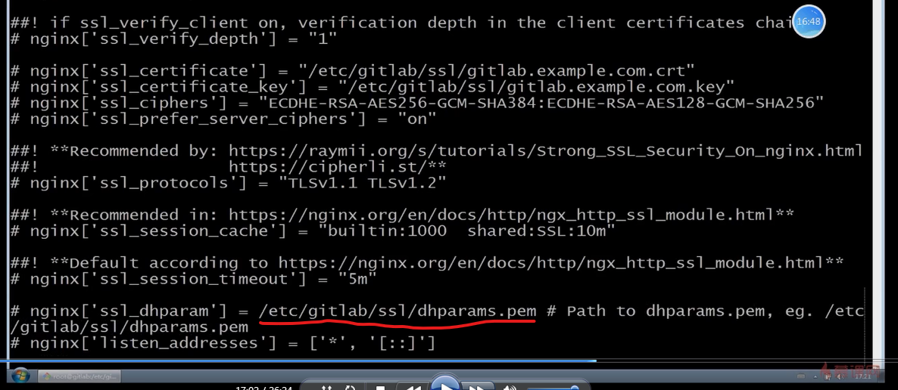
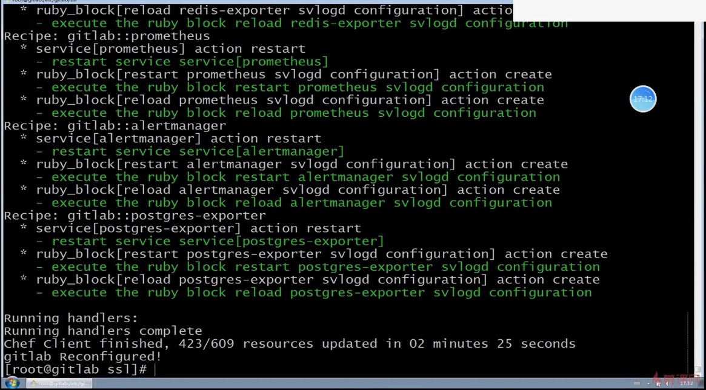
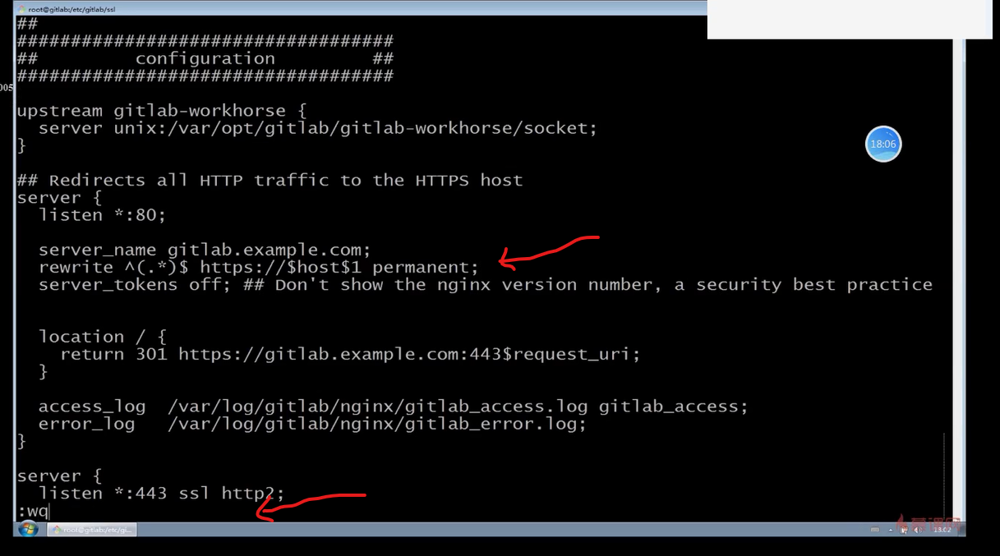
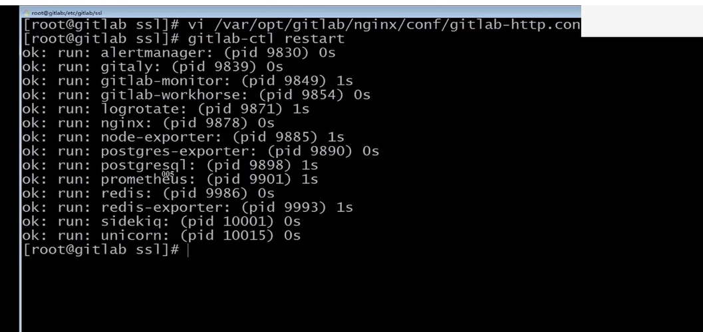
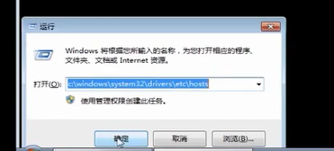
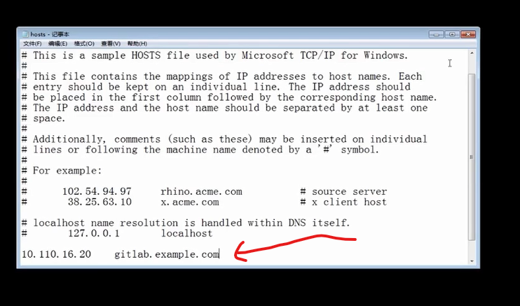

# 持续交付

版本控制系统： Gitlab github
持续集成工具： Jenkins
部署工具： Ansible Saltstack Chef

## 课程安排

- GitLab 搭建与流程使用
- Ansible 环境配置与 Playbook 编写规范
- Jenkins 环境构建与任务编写
- Freestyle 任务实现静态网站部署交付
- Pipeline 任务实现 WordPress 部署交付

## 什么是 GitLab 

- GitLab 是一个开源分布式版本控制系统
- 开发语言：Ruby
- 功能：管理项目源代码、版本控制、代码复用与查找

## GitLab 与 GitHub 的不同

- Github 分布式在线代码托管仓库，个人版本可直接在线免费使用，企业版本收费且需要服务器安装
- GitLab 分布式在线代码仓库托管软件，分社区免费版本与企业收费版本，都需要服务器安装

## GitLab 的优势和应用场景

- 开源免费，适合中小型公司将代码放置在该系统中，满足中小型公司将其安装到自己的私有网络当中
- 差异化的版本管理，离线同步以及强大分支管理功能，是我们可以针对不同的部署环境、不同的业务逻辑、不同的代码xx特征，创建不同的分支，进行并行的独立维护与更新
- 便捷的 GUI 操作界面以及强大账户权限管理功能
- 集成度很高，能够继承绝大多数的开发工具
- 支持内置 HA，保证在高并发下仍旧实现高可用性

## GitLab 主要服务构成

- Nginx 静态 Web 服务器，作为 Gitlab 的 proxy 代理，处理我们所有 Https 静态网络请求
- Gitlab-workhorse 轻量级反向代理服务器，处理较大文件上传下载，以及经常使用的 git push 命令行操作
- Gitlab-shell 用于处理 Git 命令和修改 authorized keys 列表
- Logrotate 日志文件管理工具，日志切割打包等等
- Postgresql 数据库
- Redis 缓存服务器，缓存数据库信息，加快我们前台访问速度以及数据的交互读写

## GItLab 安装配置管理

- 利用 VirtualBox 创建测试服务器
- 安装Gitlab 前系统预配置准备工作
  - 关闭 firewalld 防火墙，保证本地 pc 可以访问所有该 Centos7 下的端口资源
    - # systemctl stop firewalld 关闭当前正在运行的防火墙服务
    - # systemctl disable firewalld 禁用开机启动
    - 关闭 SELINUX 并重启系统，强制访问控制安全策略，保证该策略不会影响 gitlab 正常运行
    - # vi /etc/sysconfig/selinux   将 SELINUX=disabled
    - # reboot 重启系统
- 安装 Omnibus Gitlab-ce package，Omnibus 原意是综合性的意思，gitlab 本身包含很多服务组件以及依赖安装包，手动安装很难且很费时间，所以 gitlab 公司为了方便大家快速上手推出了 Omnibus Gitlab-ce 一键安装包
  - 1安装 Gitlab 组件
    - # yum -y install curl policycoreutils openssh-server openssh-clients postfix
  - 2配置 YUM 仓库
    - # curl - sS https://packages.gitlab.com/install/repositories/gitlab/gitlab-ce/script.rpm.sh | sudo bash
  - 3启动 postfix 邮件服务
    - # systemctl start postfix && systemctl enable postfix
  - 4安装 gitlab-ce 社区版本
    - # yum install -y gitlab-ce
- Omnibus Gitlab 等相关配置初始化并完成安装
  - 1证书创建与配置加载，使用 openssl 创建gitlab 本地证书，并配置 gitlab config 加载该证书
  - 2Nginx SSL 代理服务配置，使可以通过域名直接访问 gitlab 的所有系统资源
  - 3 使用 gitlab-ctl 管理并初始化 GItlab 相关服务并完成安装

## 实际操作

使用 git bash 下的 ssh 命令登录远程主机：

```shell
ssh root@10.110.16.20

# 然后输入密码
```

查看当前 selinux 策略是否以及被禁用：

```shell
getenforce
```

手动创建 ssl 目录：

```shell
mkdir -p /etc/gitlab/ssl
```

创建本地私有密钥

```shell
openssl genrsa -out "/etc/gitlab/ssl/gitlab.example.com.key"  2048
```

利用刚才的私有密钥创建证书

```shell
openssl req -new -key "/etc/gitlab/ssl/gitlab.example.com.key" -out "/etc/gitlab/ssl/gitlab.example.com.csr"
```

进入 csr 证书安装向导界面



查看当前目录是否创建成功 私有密钥 和 csr 证书

创建 crt 签署证书

```shell
openssl x509 -req -days 365 -in "/etc/gitlab/ssl/gitlab.example.com.csr" -signkey "/etc/gitlab/ssl/gitlab.example.com.key" -out "/etc/gitlab/ssl/gitlab.example.com.crt"
```

使用 openssl 命令输出 pem 证书

```shell
openssl dhparam -out /etc/gitlab/ssl/dhparams.pem 2048
```

更改当前目录所有证书权限

```shell
chmod 600 *
```

将所有生成的证书配置到 gitlab 配置文件中：

```shell
vim /etc/gitlab/gitlab.rb
```

找到external_url 'http://gitlab.example.com'  并将http://gitlab.example.com 改成https://gitlab.example.com




初始化gitlab 相关服务配置:

```shell
gitlab-ctl reconfigure
```
gitlab 会使用 shell 自动化部署工具初始化 gitlab 相关配置



找到 gitlab 下面的 nginx 代理工具，更改 gitlab http 配置文件

```shell
 vim /var/opt/gitlab/nginx/conf/gitlab-http.conf
```
搜索 server_name,添加一行用来重定向 gitlab https 请求


使 nginx 配置生效

```shell
gitlab-ctl restart
```


win+R 打开 hosts 文件：



添加一行手动的 dns 记录，在 windows 本机创建可以使用域名访问主机


启动浏览器登录 gitlab.example.com，第一次访问需要更改密码，然后登录管理员账号。创建一个新 project，复制仓库地址。  
复制仓库地址后，用 git bash 创建一个目录 clone：  

```shell
git -c http.sslVerify=false clone https://gitlab.example.com/root/test-repo.git
```
用来避免本地证书无法进行克隆操作。

推送分支到远端也要使用：

```shell
git -c http.sslVerify=false push origin master
```
